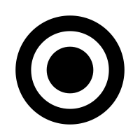
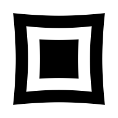
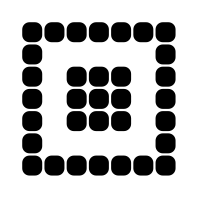
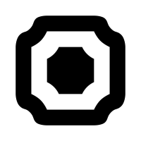
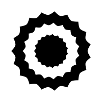
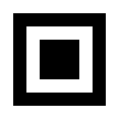

# Eye shape configuration

|  Eye Shape  |  Options  |
|:-----------:|-----------|
|  crt | _No configurable settings_ |
|  circle | _No configurable settings_ |
|  corneredPixels | • __Corner radius__  |
|  edges | • __Corner radius__  |
|  eye | • __Flippable__ • __Configurable inner corners__  |
|  fireball | _No configurable settings_ |
|  barsHorizontal | _No configurable settings_ |
|  leaf | _No configurable settings_ |
|  peacock | _No configurable settings_ |
|  pinch | _No configurable settings_ |
|  pixels | • __Corner radius__  |
|  roundedOuter | _No configurable settings_ |
|  roundedPointingIn | _No configurable settings_ |
|  roundedPointingOut | _No configurable settings_ |
|  roundedRect | • __Corner radius__  |
|  shield | • __Configurable corners__  |
|  spikyCircle | _No configurable settings_ |
|  square | _No configurable settings_ |
|  squarePeg | _No configurable settings_ |
|  squircle | _No configurable settings_ |
|  teardrop | _No configurable settings_ |
|  ufo | • __Flippable__  |
|  usePixelShape | _No configurable settings_ |
|  barsVertical | _No configurable settings_ |
