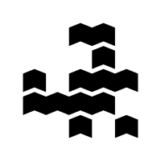
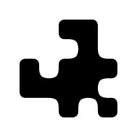
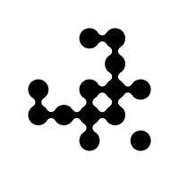
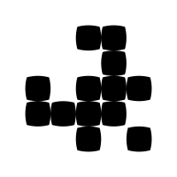
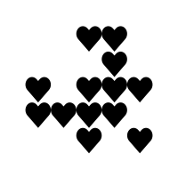
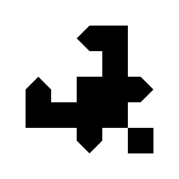
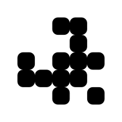
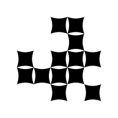
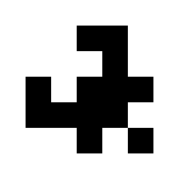
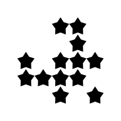

# Pixel shape options

|  Pixel Shape  |  Options  |
|:-------------:|-----------|
|  __arrow__ | • __Pixel rotation__ &nbsp;&nbsp;- Supports pixel rotation generator • __Pixel inset__ &nbsp;&nbsp;- Supports pixel inset generator  |
|  __blob__ | _none_ |
|  __circle__ | • __Pixel inset__ &nbsp;&nbsp;- Supports pixel inset generator  |
|  __circuit__ | _none_ |
|  __crt__ | • __Pixel rotation__ &nbsp;&nbsp;- Supports pixel rotation generator • __Pixel inset__ &nbsp;&nbsp;- Supports pixel inset generator  |
|  __curvePixel__ | • __Corner radius__  |
|  __donut__ | _none_ |
|  __flower__ | • __Pixel rotation__ &nbsp;&nbsp;- Supports pixel rotation generator • __Pixel inset__ &nbsp;&nbsp;- Supports pixel inset generator  |
|  __heart__ | • __Pixel rotation__ &nbsp;&nbsp;- Supports pixel rotation generator • __Pixel inset__ &nbsp;&nbsp;- Supports pixel inset generator  |
|  __horizontal__ | • __Corner radius__ • __Pixel inset__  |
|  __pointy__ | _none_ |
|  __razor__ | _none_ |
|  __roundedEndIndent__ | • __Corner radius__ • __Optional Inner corners__  |
|  __roundedPath__ | • __Corner radius__ • __Optional Inner corners__  |
|  __roundedRect__ | • __Corner radius__ • __Pixel rotation__ &nbsp;&nbsp;- Supports pixel rotation generator • __Pixel inset__ &nbsp;&nbsp;- Supports pixel inset generator  |
|  __sharp__ | • __Pixel rotation__ &nbsp;&nbsp;- Supports pixel rotation generator • __Pixel inset__ &nbsp;&nbsp;- Supports pixel inset generator  |
|  __shiny__ | _none_ |
|  __spikyCircle__ | • __Pixel rotation__ &nbsp;&nbsp;- Supports pixel rotation generator • __Pixel inset__ &nbsp;&nbsp;- Supports pixel inset generator  |
|  __square__ | • __Pixel rotation__ &nbsp;&nbsp;- Supports pixel rotation generator • __Pixel inset__ &nbsp;&nbsp;- Supports pixel inset generator  |
|  __squircle__ | • __Pixel rotation__ &nbsp;&nbsp;- Supports pixel rotation generator • __Pixel inset__ &nbsp;&nbsp;- Supports pixel inset generator  |
|  __star__ | • __Pixel rotation__ &nbsp;&nbsp;- Supports pixel rotation generator • __Pixel inset__ &nbsp;&nbsp;- Supports pixel inset generator  |
|  __vertical__ | • __Corner radius__ • __Pixel inset__  |
|  __vortex__ | _none_ |
|  __wave__ | • __Pixel rotation__ &nbsp;&nbsp;- Supports pixel rotation generator • __Pixel inset__ &nbsp;&nbsp;- Supports pixel inset generator  |
