# Pupil shape options

|  Pupil Shape  |  Options  |
|:-------------:|-----------|
|  __barsHorizontal__ | _none_ |
|  __barsHorizontalSquare__ | _none_ |
| <a href="./images/barsVertical.png">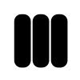</a> __barsVertical__ | _none_ |
|  __barsVerticalSquare__ | _none_ |
| <a href="./images/blobby.png">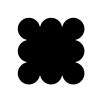</a> __blobby__ | _none_ |
| <a href="./images/circle.png">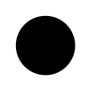</a> __circle__ | _none_ |
| <a href="./images/corneredPixels.png">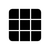</a> __corneredPixels__ | • __Corner radius__  |
|  __cross__ | _none_ |
|  __crossCurved__ | _none_ |
| <a href="./images/crt.png">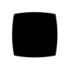</a> __crt__ | _none_ |
| <a href="./images/dotDragHorizontal.png">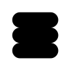</a> __dotDragHorizontal__ | _none_ |
|  __dotDragVertical__ | _none_ |
|  __edges__ | • __Corner radius__  |
| <a href="./images/explode.png">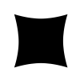</a> __explode__ | _none_ |
| <a href="./images/forest.png">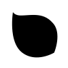</a> __forest__ | • __Flippable__  |
| <a href="./images/hexagonLeaf.png">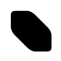</a> __hexagonLeaf__ | • __Flippable__  |
|  __leaf__ | • __Flippable__  |
| <a href="./images/orbits.png">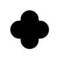</a> __orbits__ | _none_ |
| <a href="./images/pinch.png">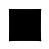</a> __pinch__ | _none_ |
| <a href="./images/pixels.png">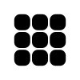</a> __pixels__ | • __Corner radius__  |
|  __roundedOuter__ | _none_ |
|  __roundedPointingIn__ | _none_ |
|  __roundedPointingOut__ | _none_ |
|  __roundedRect__ | • __Corner radius__  |
| <a href="./images/seal.png">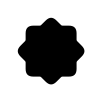</a> __seal__ | _none_ |
| <a href="./images/shield.png">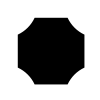</a> __shield__ | • __Configurable corners__  |
| <a href="./images/spikyCircle.png">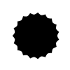</a> __spikyCircle__ | _none_ |
|  __square__ | _none_ |
| <a href="./images/squircle.png">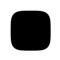</a> __squircle__ | _none_ |
| <a href="./images/teardrop.png">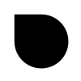</a> __teardrop__ | • __Flippable__  |
| <a href="./images/ufo.png">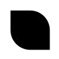</a> __ufo__ | • __Flippable__  |
|  __usePixelShape__ | _none_ |
