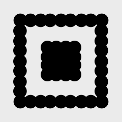
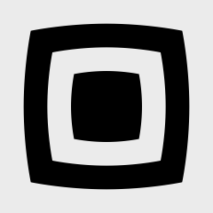
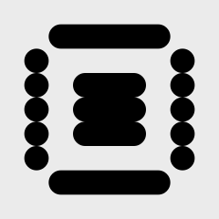
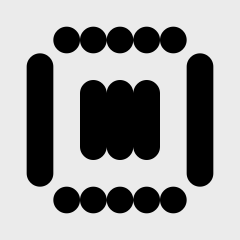
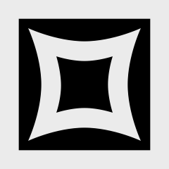
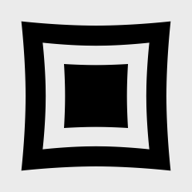
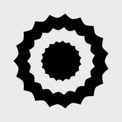
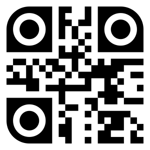
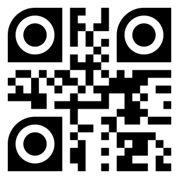

# Eye shape options

|  Preview  |  Name  | Class |  Options  | 
|:-------------:|-----------|---------|---------|
|  | __barsHorizontal__ | `QRCode.EyeShape.BarsHorizontal` | _none_ |
|  | __barsVertical__ | `QRCode.EyeShape.BarsVertical` | _none_ |
|  | __circle__ | `QRCode.EyeShape.Circle` | _none_ |
|  | __cloud__ | `QRCode.EyeShape.Cloud` | _none_ |
|  | __corneredPixels__ | `QRCode.EyeShape.CorneredPixels` | • __Corner radius__  |
|  | __crt__ | `QRCode.EyeShape.CRT` | _none_ |
|  | __dotDragHorizontal__ | `QRCode.EyeShape.DotDragHorizontal` | _none_ |
|  | __dotDragVertical__ | `QRCode.EyeShape.DotDragVertical` | _none_ |
|  | __edges__ | `QRCode.EyeShape.Edges` | • __Corner radius__  |
|  | __explode__ | `QRCode.EyeShape.Explode` | _none_ |
|  | __eye__ | `QRCode.EyeShape.Eye` | • __Flippable__ • __Configurable eye corners__  |
|  | __fireball__ | `QRCode.EyeShape.Fireball` | _none_ |
|  | __headlight__ | `QRCode.EyeShape.Headlight` | • __Flippable__  |
|  | __leaf__ | `QRCode.EyeShape.Leaf` | _none_ |
|  | __peacock__ | `QRCode.EyeShape.Peacock` | _none_ |
|  | __pinch__ | `QRCode.EyeShape.Pinch` | _none_ |
|  | __pixels__ | `QRCode.EyeShape.Pixels` | • __Corner radius__  |
|  | __roundedOuter__ | `QRCode.EyeShape.RoundedOuter` | • __Flippable__  |
|  | __roundedPointingIn__ | `QRCode.EyeShape.RoundedPointingIn` | • __Flippable__  |
|  | __roundedRect__ | `QRCode.EyeShape.RoundedRect` | • __Corner radius__  |
|  | __shield__ | `QRCode.EyeShape.Shield` | • __Configurable corners__  |
|  | __spikyCircle__ | `QRCode.EyeShape.SpikyCircle` | _none_ |
|  | __square__ | `QRCode.EyeShape.Square` | _none_ |
|  | __squarePeg__ | `QRCode.EyeShape.SquarePeg` | _none_ |
|  | __squircle__ | `QRCode.EyeShape.Squircle` | _none_ |
|  | __surroundingBars__ | `QRCode.EyeShape.SurroundingBars` | _none_ |
|  | __teardrop__ | `QRCode.EyeShape.Teardrop` | • __Flippable__  |
|  | __ufo__ | `QRCode.EyeShape.UFO` | • __Flippable__  |
|  | __usePixelShape__ | `QRCode.EyeShape.UsePixelShape` | _none_ |

## Eye mirroring

By default, the eye and pupil shapes are mirrored around the center of the generated QR code. you can disabled this
behaviour by setting `mirrorEyePathsAroundQRCodeCenter` on the shape object to `false` 

| mirrored = true | mirrored = false |
|-----------------|------------------|
|  |  |
