# Pixel shape options

|  Preview  |  Name  | Class |  Options  | 
|:-------------:|-----------|---------|---------|
|  | __abstract__ | `QRCode.PixelShape.Abstract` | _none_ |
|  | __arrow__ | `QRCode.PixelShape.Arrow` | • __Pixel rotation__ &nbsp;&nbsp;- Supports pixel rotation generator • __Pixel inset__ &nbsp;&nbsp;- Supports pixel inset generator  |
|  | __blob__ | `QRCode.PixelShape.Blob` | _none_ |
|  | __circle__ | `QRCode.PixelShape.Circle` | • __Pixel inset__ &nbsp;&nbsp;- Supports pixel inset generator  |
| <a href="../../Art/images/data_circuit.png">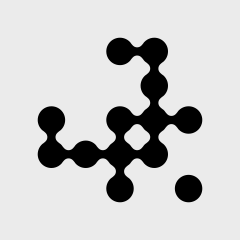</a> | __circuit__ | `QRCode.PixelShape.Circuit` | _none_ |
| <a href="../../Art/images/data_crosshatch.png">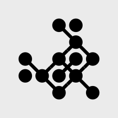</a> | __crosshatch__ | `QRCode.PixelShape.Crosshatch` | _none_ |
| <a href="../../Art/images/data_crt.png">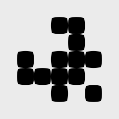</a> | __crt__ | `QRCode.PixelShape.CRT` | • __Pixel rotation__ &nbsp;&nbsp;- Supports pixel rotation generator • __Pixel inset__ &nbsp;&nbsp;- Supports pixel inset generator  |
|  | __curvePixel__ | `QRCode.PixelShape.CurvePixel` | • __Corner radius__  |
|  | __diagonal__ | `QRCode.PixelShape.Diagonal` | • __Pixel rotation__ &nbsp;&nbsp;- Supports pixel rotation generator • __Pixel inset__ &nbsp;&nbsp;- Supports pixel inset generator  |
|  | __diagonalStripes__ | `QRCode.PixelShape.DiagonalStripes` | _none_ |
|  | __diamond__ | `QRCode.PixelShape.Diamond` | • __Pixel rotation__ &nbsp;&nbsp;- Supports pixel rotation generator • __Pixel inset__ &nbsp;&nbsp;- Supports pixel inset generator  |
| <a href="../../Art/images/data_donut.png">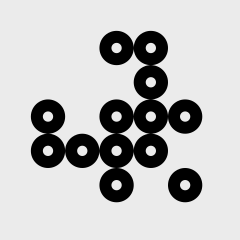</a> | __donut__ | `QRCode.PixelShape.Donut` | _none_ |
| <a href="../../Art/images/data_dripHorizontal.png">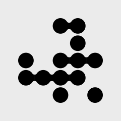</a> | __dripHorizontal__ | `QRCode.PixelShape.DripHorizontal` | _none_ |
|  | __dripVertical__ | `QRCode.PixelShape.DripVertical` | _none_ |
|  | __flame__ | `QRCode.PixelShape.Flame` | • __Pixel rotation__ &nbsp;&nbsp;- Supports pixel rotation generator • __Pixel inset__ &nbsp;&nbsp;- Supports pixel inset generator  |
|  | __flower__ | `QRCode.PixelShape.Flower` | • __Pixel rotation__ &nbsp;&nbsp;- Supports pixel rotation generator • __Pixel inset__ &nbsp;&nbsp;- Supports pixel inset generator  |
| <a href="../../Art/images/data_gear.png">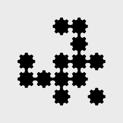</a> | __gear__ | `QRCode.PixelShape.Gear` | • __Pixel rotation__ &nbsp;&nbsp;- Supports pixel rotation generator • __Pixel inset__ &nbsp;&nbsp;- Supports pixel inset generator  |
| <a href="../../Art/images/data_grid2x2.png">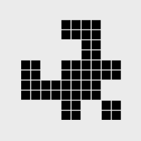</a> | __grid2x2__ | `QRCode.PixelShape.Grid2x2` | _none_ |
| <a href="../../Art/images/data_grid3x3.png">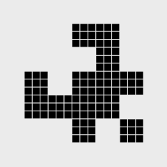</a> | __grid3x3__ | `QRCode.PixelShape.Grid3x3` | _none_ |
| <a href="../../Art/images/data_grid4x4.png">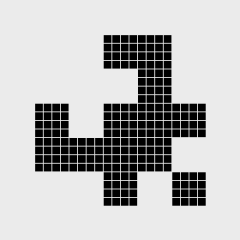</a> | __grid4x4__ | `QRCode.PixelShape.Grid4x4` | _none_ |
| <a href="../../Art/images/data_heart.png">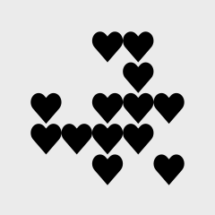</a> | __heart__ | `QRCode.PixelShape.Heart` | • __Pixel rotation__ &nbsp;&nbsp;- Supports pixel rotation generator • __Pixel inset__ &nbsp;&nbsp;- Supports pixel inset generator  |
| <a href="../../Art/images/data_hexagon.png">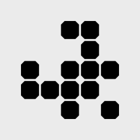</a> | __hexagon__ | `QRCode.PixelShape.Hexagon` | • __Pixel rotation__ &nbsp;&nbsp;- Supports pixel rotation generator • __Pixel inset__ &nbsp;&nbsp;- Supports pixel inset generator  |
|  | __horizontal__ | `QRCode.PixelShape.Horizontal` | • __Corner radius__ • __Pixel inset__  |
| <a href="../../Art/images/data_koala.png">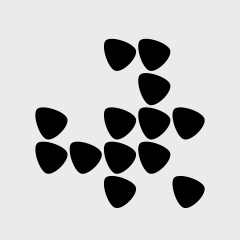</a> | __koala__ | `QRCode.PixelShape.Koala` | • __Pixel rotation__ &nbsp;&nbsp;- Supports pixel rotation generator • __Pixel inset__ &nbsp;&nbsp;- Supports pixel inset generator  |
|  | __pointy__ | `QRCode.PixelShape.Pointy` | _none_ |
|  | __razor__ | `QRCode.PixelShape.Razor` | _none_ |
|  | __roundedEndIndent__ | `QRCode.PixelShape.RoundedEndIndent` | • __Corner radius__ • __Optional Inner corners__  |
|  | __roundedPath__ | `QRCode.PixelShape.RoundedPath` | • __Corner radius__ • __Optional Inner corners__  |
|  | __roundedRect__ | `QRCode.PixelShape.RoundedRect` | • __Corner radius__ • __Pixel rotation__ &nbsp;&nbsp;- Supports pixel rotation generator • __Pixel inset__ &nbsp;&nbsp;- Supports pixel inset generator  |
| <a href="../../Art/images/data_roundedTriangle.png">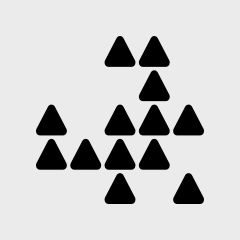</a> | __roundedTriangle__ | `QRCode.PixelShape.RoundedTriangle` | • __Pixel rotation__ &nbsp;&nbsp;- Supports pixel rotation generator • __Pixel inset__ &nbsp;&nbsp;- Supports pixel inset generator  |
|  | __sharp__ | `QRCode.PixelShape.Sharp` | • __Pixel rotation__ &nbsp;&nbsp;- Supports pixel rotation generator • __Pixel inset__ &nbsp;&nbsp;- Supports pixel inset generator  |
|  | __shiny__ | `QRCode.PixelShape.Shiny` | _none_ |
| <a href="../../Art/images/data_spikyCircle.png">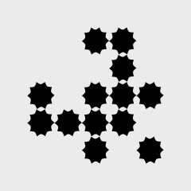</a> | __spikyCircle__ | `QRCode.PixelShape.SpikyCircle` | • __Pixel rotation__ &nbsp;&nbsp;- Supports pixel rotation generator • __Pixel inset__ &nbsp;&nbsp;- Supports pixel inset generator  |
|  | __square__ | `QRCode.PixelShape.Square` | • __Pixel rotation__ &nbsp;&nbsp;- Supports pixel rotation generator • __Pixel inset__ &nbsp;&nbsp;- Supports pixel inset generator  |
|  | __squircle__ | `QRCode.PixelShape.Squircle` | • __Pixel rotation__ &nbsp;&nbsp;- Supports pixel rotation generator • __Pixel inset__ &nbsp;&nbsp;- Supports pixel inset generator  |
|  | __star__ | `QRCode.PixelShape.Star` | • __Pixel rotation__ &nbsp;&nbsp;- Supports pixel rotation generator • __Pixel inset__ &nbsp;&nbsp;- Supports pixel inset generator  |
| <a href="../../Art/images/data_stitch.png">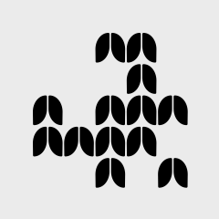</a> | __stitch__ | `QRCode.PixelShape.Stitch` | _none_ |
|  | __vertical__ | `QRCode.PixelShape.Vertical` | • __Corner radius__ • __Pixel inset__  |
|  | __vortex__ | `QRCode.PixelShape.Vortex` | _none_ |
| <a href="../../Art/images/data_wave.png">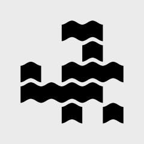</a> | __wave__ | `QRCode.PixelShape.Wave` | • __Pixel rotation__ &nbsp;&nbsp;- Supports pixel rotation generator • __Pixel inset__ &nbsp;&nbsp;- Supports pixel inset generator  |
| <a href="../../Art/images/data_wex.png">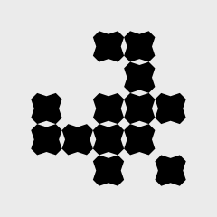</a> | __wex__ | `QRCode.PixelShape.Wex` | • __Pixel rotation__ &nbsp;&nbsp;- Supports pixel rotation generator • __Pixel inset__ &nbsp;&nbsp;- Supports pixel inset generator  |
