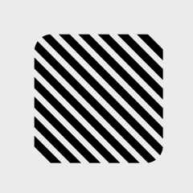

# Pupil shape options

|  Preview  |  Name  | Class |  Options  | 
|:-------------:|-----------|---------|---------|
|  | __arc__ | `QRCode.PixelShape.Arc` | _none_ |
|  | __arrow__ | `QRCode.PixelShape.Arrow` | • __Flippable__  |
|  | __barsHorizontal__ | `QRCode.PixelShape.BarsHorizontal` | _none_ |
|  | __barsHorizontalSquare__ | `QRCode.PixelShape.SquareBarsHorizontal` | _none_ |
|  | __barsVertical__ | `QRCode.PixelShape.BarsVertical` | _none_ |
|  | __barsVerticalSquare__ | `QRCode.PixelShape.SquareBarsVertical` | _none_ |
|  | __blade__ | `QRCode.PixelShape.Blade` | _none_ |
|  | __blobby__ | `QRCode.PixelShape.Blobby` | _none_ |
|  | __circle__ | `QRCode.PixelShape.Circle` | _none_ |
|  | __cloud__ | `QRCode.PixelShape.Cloud` | _none_ |
|  | __cloudCircle__ | `QRCode.PixelShape.CloudCircle` | _none_ |
|  | __corneredPixels__ | `QRCode.PixelShape.CorneredPixels` | • __Corner radius__  |
|  | __cross__ | `QRCode.PixelShape.Cross` | _none_ |
|  | __crossCurved__ | `QRCode.PixelShape.CrossCurved` | _none_ |
|  | __crt__ | `QRCode.PixelShape.CRT` | _none_ |
|  | __diagonalStripes__ | `QRCode.PixelShape.DiagonalStripes` | _none_ |
|  | __dotDragHorizontal__ | `QRCode.PixelShape.DotDragHorizontal` | _none_ |
|  | __dotDragVertical__ | `QRCode.PixelShape.DotDragVertical` | _none_ |
|  | __edges__ | `QRCode.PixelShape.Edges` | • __Corner radius__  |
|  | __explode__ | `QRCode.PixelShape.Explode` | _none_ |
|  | __fabricScissors__ | `QRCode.PixelShape.FabricScissors` | _none_ |
|  | __flame__ | `QRCode.PixelShape.Flame` | _none_ |
|  | __forest__ | `QRCode.PixelShape.Forest` | • __Flippable__  |
|  | __gear__ | `QRCode.PixelShape.Gear` | _none_ |
|  | __hexagonLeaf__ | `QRCode.PixelShape.HexagonLeaf` | • __Flippable__  |
|  | __koala__ | `QRCode.PixelShape.Koala` | • __Flippable__  |
|  | __leaf__ | `QRCode.PixelShape.Leaf` | • __Flippable__  |
|  | __orbits__ | `QRCode.PixelShape.Orbits` | _none_ |
|  | __pinch__ | `QRCode.PixelShape.Pinch` | _none_ |
|  | __pixels__ | `QRCode.PixelShape.Pixels` | • __Corner radius__  |
|  | __roundedOuter__ | `QRCode.PixelShape.RoundedOuter` | • __Flippable__  |
|  | __roundedPointingIn__ | `QRCode.PixelShape.RoundedPointingIn` | • __Flippable__  |
|  | __roundedPointingOut__ | `QRCode.PixelShape.RoundedPointingOut` | _none_ |
|  | __roundedRect__ | `QRCode.PixelShape.RoundedRect` | • __Corner radius__  |
|  | __seal__ | `QRCode.PixelShape.Seal` | _none_ |
|  | __shield__ | `QRCode.PixelShape.Shield` | • __Configurable corners__  |
|  | __spikyCircle__ | `QRCode.PixelShape.SpikyCircle` | _none_ |
|  | __square__ | `QRCode.PixelShape.Square` | _none_ |
|  | __squircle__ | `QRCode.PixelShape.Squircle` | _none_ |
|  | __teardrop__ | `QRCode.PixelShape.Teardrop` | • __Flippable__  |
|  | __ufo__ | `QRCode.PixelShape.UFO` | • __Flippable__  |
|  | __ufoRounded__ | `QRCode.PixelShape.UFORounded` | • __Flippable__  |
|  | __usePixelShape__ | `QRCode.PixelShape.UsePixelShape` | _none_ |
