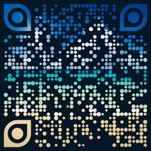

## Resulting QR Code image

<a href="beach-peacock.pdf">
   
</a>

## Code

```swift
let doc = try QRCode.Document(utf8String: "Peacock feathers style, with bubbles style on pixels")

let background = CGColor(srgbRed: 0.018, green:0.086, blue:0.15, alpha:1)
doc.design.backgroundColor(background)

doc.design.shape.eye = QRCode.EyeShape.Peacock()
doc.design.shape.onPixels = QRCode.PixelShape.Circle(insetFraction: 0.4, useRandomInset: true)

let image = NSImage(named: "beach-square")
doc.design.style.onPixels = QRCode.FillStyle.Image(image: image)

let logoQRCode = try doc.platformImage(dimension: 300, dpi: 144)
let pdfData = try doc.pdfData(dimension: 300)!
```

## Logo Image


