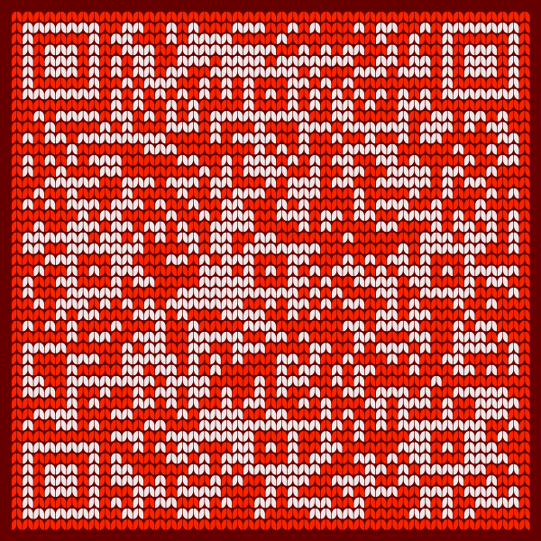

## Resulting QR Code image

<a href="ugly-sweater.png">
   
</a>

## Code

```swift
let pngData = try QRCode.build
   .text("https://uglychristmassweaters.com.au/product-category/mens-christmas-sweater/")
   .quietZonePixelCount(1)
   .backgroundColor(CGColor(srgbRed: 0.4, green: 0, blue: 0, alpha: 1))

   .onPixels.shape(.stitch())
   .onPixels.style(QRCode.FillStyle.Solid(gray: 1, alpha: 0.9))

   .offPixels.shape(.stitch())
   .offPixels.style(QRCode.FillStyle.Solid(1, 0, 0, alpha: 0.95))
   .offPixels.extendIntoEyePattern(true)

   .eye.shape(.usePixelShape())
   .eye.mirrorEyePathsAroundQRCodeCenter(false)
   
   .pupil.shape(.usePixelShape())

   .generate.png(dimension: 600)
```
