# QRCode

A simple and quick macOS/iOS/tvOS/watchOS QR Code generator/detector library for SwiftUI, Swift and Objective-C.

<p align="center">
    
    
    <a href="https://swift.org/package-manager">
        
    
    </a>
</p>
<p align="center">
    
    
    
    
    
</p>
<p align="center">
    
    
    
</p>

<p align="center">
   <a href="./Art/screenshot.png">
      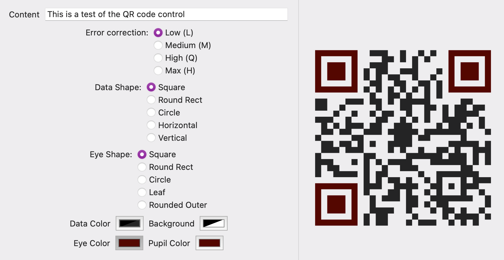
   </a>
   &nbsp;
   <a href="./Art/watchOS.png">
      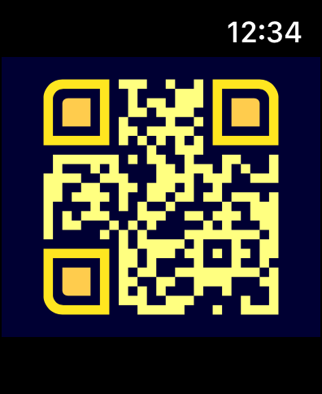
   </a>
   &nbsp;
   <a href="./Examples/people/index.md">
      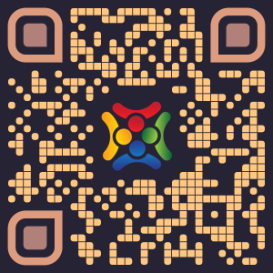
   </a>   
   &nbsp;
   <a href="./Examples/scan/index.md">
      
   </a>   

   <a href="./Examples/lineargradient/index.md">
      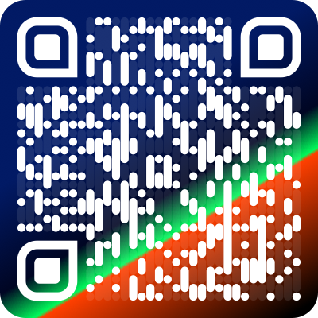
   </a>
   
   <a href="./Examples/negated/index.md">
      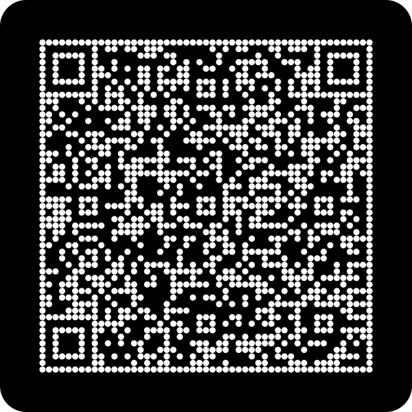
   </a>
   <a href="./Examples/green/index.md">
      
   </a>

   <a href="./Examples/logo-background/logo-background.md">
      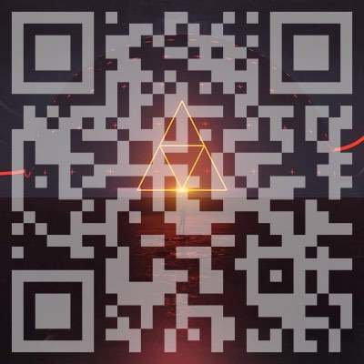
   </a>
   
   <a href="./Examples/red-b/red-b.md">
      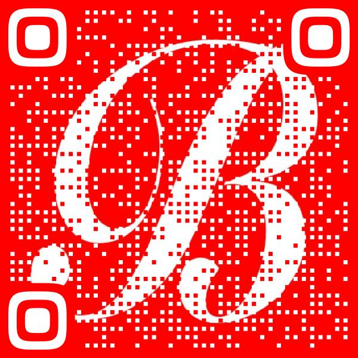
   </a>
   
   <a href="./Examples/wombles/wombles.md">
      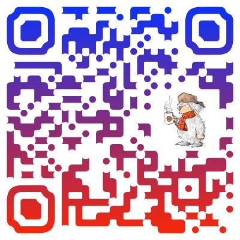
   </a>
      <a href="./Examples/wwf/index.md">
      
   </a>
</p>

## Why?

* It's nice to have a simple, quick drop-in component for displaying a QR code when you need it!
* It's nice to have your app look great!

## Features

* Supports Swift and Objective-C.
* Supports Swift Package Manager and CocoaPods
* Generate a QR code without access to a UI.
* Supports all error correction levels.
* Configurable quiet zone
* Load/Save support
* Drop-in live display support for SwiftUI, NSView (macOS) and UIView (iOS/tvOS).
* Generate images, scalable PDFs, scalable SVGs and `CGPath` paths.
* Configurable designs.
* Add a logo to a QR code.
* Configurable fill styles (solid, linear gradient, radial gradient) for image generation.
* Configurable corner radius
* Command line tool for generating qr codes from the command line (macOS 10.13+).
* Basic qr code video detection (via importing `QRCodeDetector`).

## Installing

### Swift Package Manager

To use in your project, add the following dependency to your Package.swift:

```swift
.package(url: "https://github.com/dagronf/qrcode.git", from: "16.1.1")
```

### Cocoapods

To install it, simply add the following line to your Podfile

```ruby
pod 'DSF_QRCode', '~> 16.1.1'
```

### Usage

The core functionality for generating a nice QR code is found in the `QRCode` library.

If you want to use the qr code video detection, you'll need to import the `QRCodeDetector` library.  The reason for
separating these out into two different libraries is because video detection **requires** your app to have a
`NSCameraUsageDescription` defined in your including app (along with adding an `AVFoundation` dependency) if you're
putting it on the app store - something that you may not want if your app doesn't need it!

* For QR code generation, link against `QRCode`
* For QR code video detection, link against `QRCodeDetector` 

### In your source

Swift: `import QRCode`

Objective-C: `@import QRCode;`

## Generating a QR Code

The `QRCode.Document` class is the core class you will interact with. It is not tied to any presentation medium and is cross-platform across Apple OSes.

You can use this class to generate a QR Code and present the result as a `CGPath` or a `CGImage`. And if you're using Swift you can retrieve the raw qr code data as a 2D array of `Bool` to use however you need.

You can create a basic black-and-white QR code image very easily.

```swift
let doc = QRCode.Document(utf8String: "Hi there!", errorCorrection: .high)
let generated = doc.cgImage(CGSize(width: 800, height: 800))
```

Generates


You can further style the qr code (see below) 

<details>
<summary>tl;dr Simple Example</summary>
 
```swift
let doc = QRCode.Document()
doc.utf8String = "This is a test"
doc.errorCorrection = .high

// Set the background color to clear
doc.design.backgroundColor(CGColor.clear)

// Set the foreground color to blue
doc.design.foregroundColor(CGColor.blue)

// Generate a CGPath object containing the QR code
let path = doc.path(CGSize(width: 400, height: 400))

// Generate an image using the default styling (square, black foreground, white background) with 3x resolution
let image = doc.uiImage(CGSize(width: 400, height: 400), dpi: 216)

// Generate pdf data containing the qr code
let pdfdata = doc.pdfData(CGSize(width: 400, height: 400))

// Save a JSON representation of the qrcode document
let jsonData = try doc.jsonData()

// Load a qr code from json
let loadedDoc = try QRCode.Document(jsonData: jsonData)
```

</details>

There are also some extensions on `CGImage` to help making qr codes even easier

```swift
let qrCodeImage = CGImage.qrCode("Hi there!", dimension: 800)
```

## Settings

### Set the data content

```swift
/// Set raw data
@objc public var data: Data

/// Set a string
public func setString(
   _ string: String, 
   encoding: String.Encoding = .utf8, 
   allowLossyConversion: Bool = false) -> Bool

/// Set raw data using a qrcode message formatter
@objc func setMessage(_ message: QRCodeMessageFormatter)
```

### Set the error correction

```swift
@objc public var errorCorrection: QRCode.ErrorCorrection = .quantize
```

The `QRCode.Document` has 4 different encoding levels

| Error correction | Description                                          |
|------------------|:-----------------------------------------------------|
| low              | Lowest error correction (L - Recovers 7% of data)    |
| medium           | Medium error correction (M - Recovers 15% of data)   |
| quantize         | Quantize error correction (Q - Recovers 25% of data) |
| high             | High error correction (H - Recovers 30% of data)     |

The higher the error correction level, the larger the QR code will be.

## Design

`QRCode` supports a number of ways of 'designing' your qr code.  By default, the qr code will be generated in its traditional form - square, black foreground and white background. By tweaking the design settings of the qr code you can make it a touch fancier.

**Note** You can fancify your QR code so much that it can no longer be read by readers.

1. Always check that your QR code can be read **at the size that it will be presented to users**. (hint: use your phone!)
2. Have good contrast between the QR Code and its background
3. If you use 'off' pixels (see below) make sure they are very high contrast to the 'on' pixels.
4. Don't have high contrast between the 'on' pixels and the eye.

The design comprises two components :-

|        | Description    |
|--------|:--------------------------------------------------------------------------|
| shape  | The shape of each of the individual components within the QR code         |
| style  | The fill styles for each of the individual components within the QR code  |

You can individually specify the shape and fill style for each of the components of the QR code.

### QR code components

The QRCode is made up of four distinct components

* The 'on' data pixels (`onPixels`)
* The eye, which is made up of an `eye` (the outer part of the eye) and a `pupil` (the inner part).
* The 'off' data pixels (`offPixels`)

### Eye shape

You can provide an `EyeShape` object to style just the eyes of the generated qr code. There are built-in generators for
square, circle, rounded rectangle, and more.

| Preview | Name | Class | Description |
|:---:|---|---|---|
|            |"square"|`QRCode.EyeShape.Square`|Simple square (default)|
|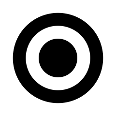            |"circle"|`QRCode.EyeShape.Circle`|Simple circle|
|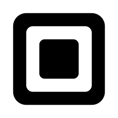       |"roundedRect"|`QRCode.EyeShape.RoundedRect`|Simple rounded rect|
|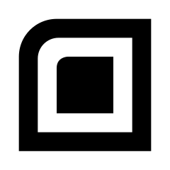      |"roundedOuter"|`QRCode.EyeShape.RoundedOuter`|Square with the outer corner rounded|
|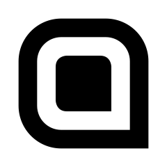 |"roundedPointingIn"|`QRCode.EyeShape.RoundedPointingIn`|A rounded rect with the 'inner' corner as a point|
|              |"leaf"|`QRCode.EyeShape.Leaf`|An eye that look like a leaf|
|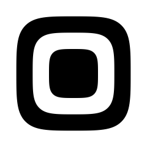          |"squircle"|`QRCode.EyeShape.Squircle`|A superellipse shape (somewhere between a square and a circle)|
|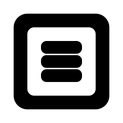    |"barsHorizontal"|`QRCode.EyeShape.BarsHorizontal`|Simple rounded rect with three horizontal bars as the pupil|
|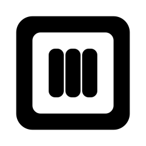      |"barsVertical"|`QRCode.EyeShape.BarsVertical`| Simple rounded rect with three vertical bars as the pupil|
|            |"pixels"|`QRCode.EyeShape.Pixels`| A simple collection of pixels with configurable corner radius for each pixel|
|    |"corneredPixels"|`QRCode.EyeShape.CorneredPixels`| A simple collection of pixels with configurable corner radius for the entire shape|
|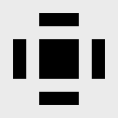             |"edges"|`QRCode.EyeShape.Edges`| Simple bordered bars with a configurable corner radius |
|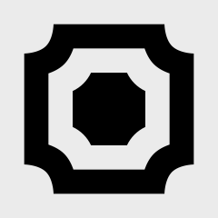            |"shield"|`QRCode.EyeShape.Shield`| A shield with configurable corners |

### Custom Pupil shape (optional)

You can provide an override to the default `EyeShape` pupil shape to change just the shape of the pupil. There are built-in generators for square, circle, rounded rectangle, and more.

If you don't override the pupil shape, it defaults to the eye shape's pupil shape.

| Preview | Name | Class | Description |
|:---:|---|---|---|
|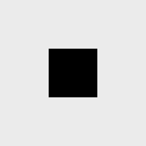           |"square"|`QRCode.PupilShape.Square`|Simple square (default)|
|           |"circle"|`QRCode.PupilShape.Circle`|Simple circle|
|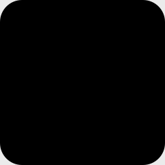      |"roundedRect"|`QRCode.PupilShape.RoundedRect`|Simple rounded rect|
|     |"roundedOuter"|`QRCode.PupilShape.RoundedOuter`|Square with the outer corner rounded|
|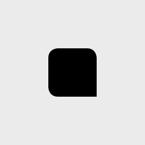|"roundedPointingIn"|`QRCode.PupilShape.RoundedPointingIn`|A rounded rect with the inner corner as a point|
|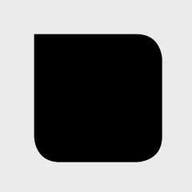|"roundedPointingOut"|`QRCode.PupilShape.RoundedPointingOut`|A rounded rect with the outer corner as a point|
|             |"leaf"|`QRCode.PupilShape.Leaf`|An eye that look like a leaf|
|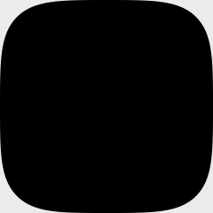         |"squircle"|`QRCode.PupilShape.Squircle`|A superellipse shape (somewhere between a square and a circle)|
|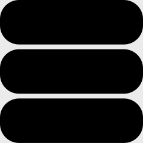   |"barsHorizontal"|`QRCode.PupilShape.BarsHorizontal`|Simple rounded rect with three horizontal bars as the pupil|
|     |"barsVertical"|`QRCode.PupilShape.BarsVertical`| Simple rounded rect with three vertical bars as the pupil|
|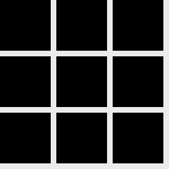           |"pixels"|`QRCode.PupilShape.Pixel`| A simple collection of pixels with configurable corner radius for each pixel |
|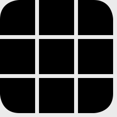   |"corneredPixels"|`QRCode.PupilShape.CorneredPixels`| A simple collection of pixels with configurable corner radius for the entire shape |
|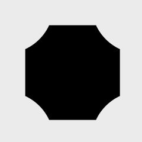           |"shield"|`QRCode.PupilShape.Shield`|  A shield with configurable corners |

<details>
<summary>Example</summary>

```swift
let doc = QRCode.Document(utf8String: "Custom pupil")
doc.design.style.background = QRCode.FillStyle.Solid(CGColor.white)
doc.design.shape.eye = QRCode.EyeShape.Squircle()
doc.design.style.eye = QRCode.FillStyle.Solid(0.149, 0.137, 0.208)
doc.design.shape.pupil = QRCode.PupilShape.BarsHorizontal()
doc.design.style.pupil = QRCode.FillStyle.Solid(0.314, 0.235, 0.322)
doc.design.style.onPixels = QRCode.FillStyle.Solid(0.624, 0.424, 0.400)
```


</details>

### 'OnPixels' shape

The data shape represents how the 'pixels' within the QR code are displayed.  By default, this is a simple square, 
however you can supply a `PixelShape` object to custom-draw the data.  There are built-in generators for a variety of styles.

| Preview | Name | Class | Description |
|---|---|---|---|
|           |"square"|`QRCode.PixelShape.Square`|A basic square pixel (default)|
|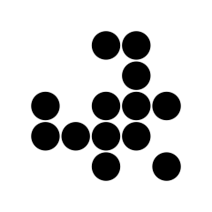           |"circle"|`QRCode.PixelShape.Circle`|A basic circle pixel|
|       |"curvePixel"|`QRCode.PixelShape.CurvePixel`|A pixel that curves to follow paths|
|      |"roundedRect"|`QRCode.PixelShape.RoundedRect`|A basic rounded rectangle pixel with configurable radius|
|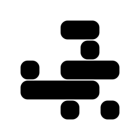       |"horizontal"|`QRCode.PixelShape.Horizontal`|The pixels are horizonally joined to make continuous horizontal bars|
|         |"vertical"|`QRCode.PixelShape.Vertical`|The pixels are vertically joined to make continuous vertical bars|
|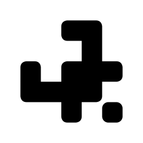      |"roundedPath"|`QRCode.PixelShape.RoundedPath`|A smooth rounded-edge path|
| |"roundedEndIndent"|`QRCode.PixelShape.RoundedEndIndent`|Rounded path with circular indented ends|
|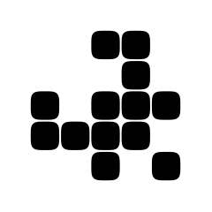         |"squircle"|`QRCode.PixelShape.Squircle`|A superellipse shape (somewhere between a square and a circle)|
|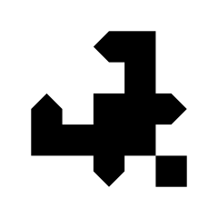           |"pointy"|`QRCode.PixelShape.Pointy`|A 'pointy' style|
|            |"sharp"|`QRCode.PixelShape.Sharp`|A 'sharp' style|
|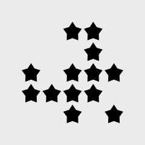             |"star"|`QRCode.PixelShape.Star`|A 'star' style|
|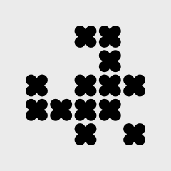           |"flower"|`QRCode.PixelShape.Flower`| A 'flower' style |
|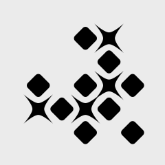           | "shiny" |`QRCode.PixelShape.Shiny` | A pixel style that appears 'shiny' |

#### 'offPixels' shape (optional)

You can specify a shape to be drawn when a data 'pixel' is _off_. This can be used to make your qr code prettier.
Just remember that the more embellishment you add to a QR code the more difficult it will be to read.

It's really important to make sure that there is a high color contrast between the 'offPixels' shape and the 'onPixels' shape to aid readers.

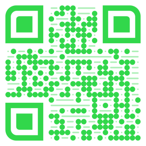

<details>
<summary>QRCode source</summary>

```swift
let doc1 = QRCode.Document(utf8String: "Hi there noodle")
doc1.design.backgroundColor(NSColor.white.cgColor)
doc1.design.shape.eye = QRCode.EyeShape.RoundedOuter()
doc1.design.shape.onPixels = QRCode.PixelShape.Circle()
doc1.design.style.onPixels = QRCode.FillStyle.Solid(NSColor.systemGreen.cgColor)
doc1.design.shape.offPixels = QRCode.PixelShape.Horizontal(insetFraction: 0.4, cornerRadiusFraction: 1)
doc1.design.style.offPixels = QRCode.FillStyle.Solid(NSColor.systemGreen.withAlphaComponent(0.4).cgColor)

// Set a custom pupil shape. If this isn't set, the default pixel shape for the eye is used
doc1.design.shape.pupil = QRCode.PupilShape.BarsHorizontal()

// Generate a image for the QRCode
let cgImage = doc1.cgImage(CGSize(width: 300, height: 300))
```

</details>

### Fill styles

You can provide a custom fill for any of the individual components of the qr code.

* The 'onPixels'
* The eye (outer)
* The pupil (inner)
* The 'offPixels'

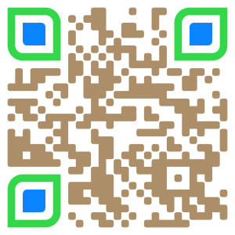

<details>
<summary>QRCode source</summary>

```swift
let doc2 = QRCode.Document(utf8String: "Github example for colors")
doc2.design.backgroundColor(NSColor.white.cgColor)
doc2.design.shape.eye = QRCode.EyeShape.RoundedOuter()
doc2.design.shape.onPixels = QRCode.PixelShape.RoundedPath()

// Eye color
doc2.design.style.eye = QRCode.FillStyle.Solid(NSColor.systemGreen.cgColor)
// Pupil color
doc2.design.style.pupil = QRCode.FillStyle.Solid(NSColor.systemBlue.cgColor)
// Data color
doc2.design.style.onPixels = QRCode.FillStyle.Solid(NSColor.systemBrown.cgColor)

// Generate a image for the QRCode
let cgImage = doc2.cgImage(CGSize(width: 300, height: 300))
```

</details>

This library supports the current fill types.

* solid fill (`QRCode.FillStyle.Solid`)
* linear gradient (`QRCode.FillStyle.LinearGradient`)
* radial gradient (`QRCode.FillStyle.RadialGradient`)
* image (`QRCode.FillStyle.Image`)

#### Style examples

A simple QRCode with a red radial fill.

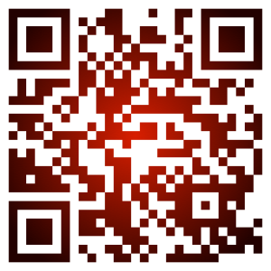

<details>
<summary>QRCode source</summary>

```swift
let doc3 = QRCode.Document(utf8String: "Github example for colors")
doc3.design.style.background = QRCode.FillStyle.Solid(CGColor.white)

// Set the fill color for the data to radial gradient
let radial = QRCode.FillStyle.RadialGradient(
   DSFGradient(pins: [
      DSFGradient.Pin(CGColor(red: 0.8, green: 0, blue: 0, alpha: 1), 0),
      DSFGradient.Pin(CGColor(red: 0.1, green: 0, blue: 0, alpha: 1), 1)
   ])!,
   centerPoint: CGPoint(x: 0.5, y: 0.5)
)
doc3.design.style.onPixels = radial

// Generate a image for the QRCode
let cgImage = doc3.cgImage(CGSize(width: 300, height: 300))
```

</details>

## Adding a logo to a QR code

The `QRCode.LogoTemplate` class is used to define a logo on the QR code. 
The document has a `logoTemplate` member where this can be set (see the examples below)

### WARNING

Adding a logo can heavily adversely affect the ability to recognise the content of the QR code. If you add a logo it's highly recommended to set the errorCorrection levels to `.high`.
Logos that cover more than 25% of the data tend to cause more failures than successes when reading. 

After adding an image its important to verify that the qr code can be read (Most phone cameras can read qr codes).
If the logo ends up covering more that 25% of the data, it is highly likely your QR code will have trouble being read by some readers.
Before reporting a bug about the qr code failing to be read, remove the image and retry. If the code can be read without the image it means your logo is too big.

### Method 1: Logo Masking

The simplest method is to provide a logo and an optional transparent image mask. 
If the mask is not supplied, the library will use the transparency information from the logo image to generate a mask for you.

The image and mask image should be the same size and square for the best results. Both the logo and the mask will be scaled to the final size of the QR code before application.

|  logo  |  mask  |    | result |
|:------:|:------:|:--:|:------:|
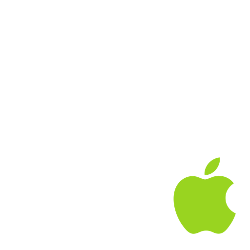 | 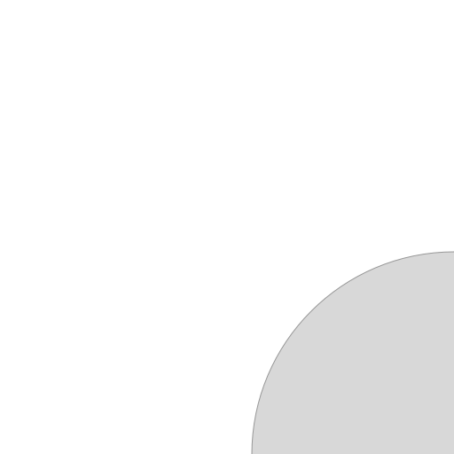 | ➜ |  |


<details>
<summary>Sample image and mask examples </summary>

#### Logo and mask

```swift
let doc = QRCode.Document(utf8String: "Adding a logo to a QR code using an image and a mask image", errorCorrection: .high)
let logoImage = ... some logo image ...
let logoMaskImage = ... some mask image ...
doc.logoTemplate = QRCode.LogoTemplate(logoImage: logoImage, maskImage: logoMaskImage)
```

|  logo  |  mask  | result |
|:------:|:------:|:------:|
 |  |  |

#### Logo only

```swift
let doc = QRCode.Document(utf8String: "Adding a logo to a QR code using an image's transparency", errorCorrection: .high)
let logoImage = ... some logo image ...
doc.logoTemplate = QRCode.LogoTemplate(logoImage: logoImage)
```

|  logo  | result |
|:------:|:------:|
 | 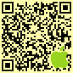 |


</details>

### Method 2: Logo templates

The logo template defines an image and a _relative_ path in the QRCode in which to draw the image.

The relative path represents the section in the QR code 'data' where the image is drawn. It represents a _relative_
path (ie. x=0.0, y=0.0, width=1.0, height=1.0) within the bounds of the QR code.

x=0.0, y=0.0 represents the **top left** of the qr code.

For example, if you wanted to put a circle logo in the center of your qr code where the circle is 
exactly 1/3 of the size of the QR code, then the path is defined as :-

<a href="./Art/logo-template-path-center.png">
  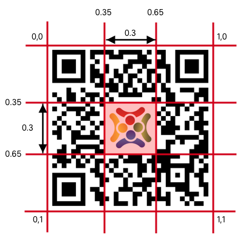
</a>  

```swift
let path = CGPath(ellipseIn: CGRect(x: 0.35, y: 0.30, width: 0.3, height: 0.3), transform: nil)
```

(note that a 1/3 mask will most likely render the qr code unreadable :-). 

A 1/4 size rectangular logo in the lower right of the qr code would be :- 

<a href="./Art/logo-template-path-lower-right.png">
  
</a>

```swift
let path = CGPath(rect: CGRect(x: 0.75, y: 0.75, width: 0.25, height: 0.25), transform: nil)
```

The mask path only affects the `onPixels` and `offPixels` within the QR code. Defining a logo that falls within the eye boundaries will be clipped. 

There are a number of pre-built `LogoTemplate` creators for the 'standard' logo positions.

* circle center (`QRCode.LogoTemplate.CircleCenter`)
* circle bottom right (`QRCode.LogoTemplate.CircleBottomRight`)
* square center (`QRCode.LogoTemplate.SquareCenter`)
* square bottom right (`QRCode.LogoTemplate.SquareBottomRight`) 

<details>
<summary>Logo Template Examples</summary>

### Example 1

```swift
// Define a rectangle mask within the bounds of the QR code. A centered square, 30% of the qr code size.
let doc = QRCode.Document(...)

doc.logoTemplate = QRCode.LogoTemplate(
   path: CGPath(rect: CGRect(x: 0.35, y: 0.35, width: 0.30, height: 0.30), transform: nil), 
   inset: 3,
   image: UIImage(named: "square-logo")?.cgImage
)

let qrCodeWithLogo = doc.nsImage(dimension: 300)
```

generates

<a href="./Art/images/qrcode-with-logo-example.png"></a>

### Example 2

A round logo in the lower right of the qr code

```swift
let doc = QRCode.Document(...)
doc.logoTemplate = QRCode.LogoTemplate(
   path: CGPath(ellipseIn: CGRect(x: 0.7, y: 0.7, width: 0.30, height: 0.30), transform: nil),
   inset: 8
)
let image = NSImage(named: "instagram-icon")!
let qrCodeWithLogo = doc.uiImage(dimension: 300, image: image)
```

generates

<a href="./Art/images/qrcode-with-logo-example-bottom-right.png">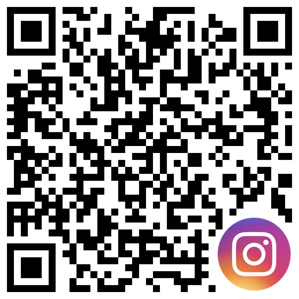</a>

</details>

## Quiet zone

You can add a quiet zone around the outside of the QR code by setting `additionalQuietZonePixels` on the design object. This represents the number of pixels spacing are added around the outside of the actual QR Code.

Note that a background color/image/fill is not affected by the quiet zone (will always extend to the boundaries of the generated image)

By default, the quiet zone is set to 0 pixels.

| 0 pixels | 5 pixels | 10 pixels | 15 pixels | Background Image<br/> with 6 pixels |
|:----:|:----:|:----:|:----:|:----:|
| <a href="./Art/images/quiet-space-0.png"></a> | <a href="./Art/images/quiet-space-5.png">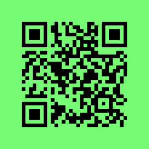</a> | <a href="./Art/images/quiet-space-10.png">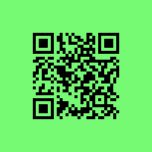</a> | <a href="./Art/images/quiet-space-15.png">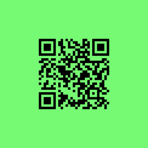</a> | <a href="./Art/images/quiet-space-background-image.png"></a> |

```swift
let doc = QRCode.Document(utf8String: "https://www.swift.org/about/")
doc.design.style.background = QRCode.FillStyle.Solid(0.410, 1.000, 0.375)
doc.design.additionalQuietZonePixels = 4
let qrcodeImage = doc.cgImage(CGSize(width: 300, height: 300))
```

## Background Corner Radius

You can specify a corner radius for your background fill on the style object, which is in fractional qr code data-pixel values.

By default, the corner radius is set to 0.

| 0 pixels | 2 pixels | 4 pixels | 6 pixels |
|:--------:|:--------:|:--------:|:--------:|
| <a href="./Art/images/quiet-space-0.png"></a> | <a href="./Art/images/quiet-space-0.png"></a> | <a href="./Art/images/quiet-space-0.png"></a> | <a href="./Art/images/quiet-space-0.png"></a> |

<details>
<summary>Background corner radius example</summary>

```swift
let doc = QRCode.Document(utf8String: "Corner radius checking")
doc.design.style.background = QRCode.FillStyle.Solid(1, 0, 0)
doc.design.foregroundStyle(QRCode.FillStyle.Solid(1, 1, 1))
doc.design.additionalQuietZonePixels = 2
doc.design.style.backgroundFractionalCornerRadius = 3.0
let qrcodeImage = doc.cgImage(CGSize(width: 300, height: 300))
```

<a href="./Art/images/corner-radius-example.png"></a>

</details>

## Message Formatters

There are a number of QRCode data formats that are somewhat common with QR code readers, such as QR codes 
containing phone numbers or contact details.

There are a number of built-in formatters for generating some common QR Code types. These can be found in the `messages` subfolder.

* URLs (Link)
* Generate an email (Mail)
* A phone number (Phone)
* Contact Details (Contact)
* A UTF-8 formatted string (Text)

## Generating output

### Generate a path

```swift
@objc func path(_ size: CGSize, components: Components, design: QRCode.Design) -> CGPath
```

Produces a CGPath representation of the QRCode

* The size in pixels of the generated path
* The components of the qr code to include in the path (defaults to the standard QR components)
   * The eye 'outer' ring
   * The eye pupil
   * The pixels that are 'on' within the QR Code
   * The pixels that are 'off' within the QR Code
* The shape of the qr components

The components allow the caller to generate individual paths for the QR code components which can then be individually styled and recombined later on. 

There are also extensions on `CGPath` to make it even easier to generate a `CGPath` from a qr code.

```swift
let qrcodePath = CGPath.qrCode("This is a test!!!", dimension: 800)
```

### Generating a styled image

```swift
@objc func cgImage(_ size: CGSize, dpi: CGFloat = 72.0) -> CGImage?
```

Generate an CGImage from the QR Code, using an (optional) design object for styling the QR code

```swift
@objc func nsImage(_ size: CGSize, dpi: CGFloat = 72.0) -> NSImage?
```

*(macOS only)* Generate an NSImage from the QR Code, using an (optional) design object for styling the QR code

```swift
@objc func uiImage(_ size: CGSize, dpi: CGFloat = 72.0) -> UIImage?
```

*(iOS/tvOS/watchOS/macCatalyst only)* Generate an UIImage from the QR Code, using an (optional) design object for styling the QR code

### Generate a styled, scalable PDF representation of the QR Code

```swift
@objc func pdfData(_ size: CGSize, pdfResolution: CGFloat) -> Data?
```

Generate a scalable PDF from the QRCode using an (optional) design object for styling the QR code and resolution

### Generate a SVG representation of the QR Code

```swift
@objc func svg(dimension: Int) -> String
```

Generate an SVG representation of the QR code.

### Add a QR Code to the pasteboard (macOS/iOS)

Adds multiple representations of the QRCode to the specified pasteboard

| Platform | Added Types        |
|:---------|:-------------------|
| macOS    | `PDF`/`PNG`/`TIFF` | 
| iOS      | `PDF`/`PNG`        |

```swift
@objc func addToPasteboard(pasteboard: NSPasteboard = NSPasteboard.general, _ size: CGSize, dpi: CGFloat = 72.0)
@objc func addToPasteboard(pasteboard: UIPasteboard = UIPasteboard.general, _ size: CGSize, dpi: CGFloat = 72.0)
```

### Generate a text representation of the QR Code

```swift
@objc func asciiRepresentation() -> String
```

Return an ASCII representation of the QR code using the extended ASCII code set

Only makes sense if presented using a fixed-width font.
	
```swift
@objc func smallAsciiRepresentation() -> String
```

Returns an small ASCII representation of the QR code (about 1/2 the regular size) using the extended ASCII code set

Only makes sense if presented using a fixed-width font.

## Presentation

This library provides drop-in components for presenting a styled QR code.

### NSView/UIView

#### `QRCodeDocumentView`

`QRCodeDocumentView` is a view implementation to display a `QRCode.Document` object.

#### `QRCodeView`

`QRCodeView` is a view implementation for displaying a QR Code. This view supports :-

* `@IBDesignable` via Interface Builder so you can design and style your QR code completely within Interface Builder without having a `QRCode.Document` object.
* (Optional) drag support for dragging a QR code out of the view.

### SwiftUI

#### `QRCodeViewUI`

The simplest way to add a stylish QR code to your SwiftUI app. `QRCodeViewUI` is a SwiftUI view for displaying a qrcode with just the basic styling elements.

```swift
QRCodeViewUI(
   content: "This is a test",
   foregroundColor: CGColor(srgbRed: 1, green: 0.8, blue: 0.6, alpha: 1.0),
   backgroundColor: CGColor(srgbRed: 0.2, green: 0.2, blue: 0.8, alpha: 1.0),
   pixelStyle: QRCode.PixelShape.RoundedPath(cornerRadiusFraction: 0.7, hasInnerCorners: true),
   eyeStyle: QRCode.EyeShape.RoundedRect()
)
```

#### `QRCodeDocumentViewUI`

If you need more control over the styling and content of your QR code, `QRCodeDocumentViewUI` is a `SwiftUI` view that displays a `QRCode.Document` object. 

```swift
   var body: some View {
         VStack {
            QRCodeDocumentUIView(document: doc)
         }
         .padding()
   }
```


#### `QRCodeShape`

`QRCodeShape` is a `SwiftUI` Shape object generating paths from different components of a QR code. 

So anything you can do with any SwiftUI shape object (eg. a rectangle) you can now do with a styled QRCode shape outline. 

For example, you can use `.fill` to set the color content (eg. a linear gradient, solid color etc), add a drop shadow, add a transform etc...

<details>
<summary>Example</summary> 

```swift
let qrContent = QRCodeShape(myData)
...
ZStack {
   qrContent
      .components(.eyeOuter)
      .fill(.green)
   qrContent
      .components(.eyePupil)
      .fill(.teal)
   qrContent
      .components(.onPixels)
      .fill(.black)
}
```

</details>

### Modifiers

```swift
func errorCorrection(_ errorCorrection: QRCode.ErrorCorrection) -> QRCodeShape {
```
Set the error correction level

```swift
func components(_ components: QRCode.Components) -> QRCodeShape
```

Set which components of the QR code to be added to the path

```swift
func shape(_ shape: QRCode.Shape) -> QRCodeShape
```

Set the shape (onPixels, offPixels, eye, pupil)

```swift
func eyeShape(_ eyeShape: QRCodeEyeShape) -> QRCodeShape
```

Set the shape of the eye (eye and pupil)

```swift
func pupilShape(_ pupilShape: QRCodePupilShape) -> QRCodeShape
```

Set the shape of the pupil

```swift
func onPixelShape(_ pixelShape: QRCodePixelShape) -> QRCodeShape
```

Set the shape of the 'on' pixels in the QR code

```swift
func offPixelShape(_ pixelShape: QRCodePixelShape) -> QRCodeShape
```

Set the shape of the 'off' pixels in the QR code

```swift
func relativeMaskPath(_ maskPath: CGPath) -> QRCodeShape
```

Set the masking path

<details>
<summary>Example</summary> 

```swift
struct ContentView: View {

   @State var content: String = "This is a test of the QR code control"
   @State var correction: QRCodeView.ErrorCorrection = .low

   var body: some View {
      Text("Here is my QR code")
      QRCodeShape(
         text: content,
         errorCorrection: correction
      )
      .fill(LinearGradient(gradient: gradient, startPoint: .topLeading, endPoint: .bottomTrailing))
      .shadow(color: .black, radius: 1, x: 1, y: 1)
      .frame(width: 250, height: 250, alignment: .center)
   }
}
```
</details>

## Objective-C

The `QRCode` library fully supports Objective-C.

<details>
<summary>Example</summary> 

```objc
QRCode* code = [[QRCode alloc] init];
[code updateWithText: @"This message"
     errorCorrection: QRCodeErrorCorrectionMax];

QRCodeStyle* style = [[QRCodeStyle alloc] init];

// Set the foreground color to a solid red
style.onPixels = [[QRCodeFillStyleSolid alloc] init: CGColorCreateGenericRGB(1, 0, 0, 1)];

// Use the leaf style
style.shape.eyeShape = [[QRCodeEyeStyleLeaf alloc] init];

// Generate the image
CGImageRef image = [code image: CGSizeMake(400, 400) scale: 1.0 style: style];
NSImage* nsImage = [[NSImage alloc] initWithCGImage:image size: CGSizeZero];
```
</details>

## Load/Save

The `QRCode.Document` class has methods for loading/saving QRCode definitions to a JSON format

```swift
let qrCode = QRCode.Document()
qrCode.data = "this is a test".data(using: .utf8)!
qrCode.design.shape.onPixels = QRCode.PixelShape.Circle()
qrCode.design.shape.eye = QRCode.EyeShape.Leaf()

let jsonData = try qrCode.jsonData()

...

let loadedQRCode = try QRCode.Document.Create(jsonData: jsonData)
```

## Detecting QR Codes

### From an image

The library provides a mechanism for detecting QR codes in an image

```swift
// CGImage/NSImage/UIImage detection
if let detected = QRCode.DetectQRCodes(in: /*some image*/),
   detected.count > 0 {
   // Do something with the detected qr codes
   let qrCodeBounds = detected[0].bounds
   let qrCodeMessage = detected[0].messageString
   ...
}
```

Even easier, there is an extension on `CGImage` to detect the strings encoded within the image if you only want the string content for each match.

```swift
let image = CGImage(...)
let messages = image.qrCodedMessages()
```

### From a video stream

In order to allow `QRCode` to be used in App Store or Test Flight targets without having to allow Camera usage,
the video detector component has been extracted out into its own target, `QRCodeDetector`.

There is a video detector class `QRCodeDetector.VideoDetector` which is a very basic qr code detector for video streams.

There are two basic demos demonstrating the qr code detection in a video stream.

* `macOS QRCode Detector`: Video qr code detector for macOS targets
* `iOS QRCode Detector`: Video qr code detector for iOS targets (requires a real device)

## Demo

There are a number of demo apps which you can find in the `Demo` subfolder.  There are simple demo applications for

* SwiftUI (macOS, iOS, macCatalyst, watchOS)
* iOS (Swift, including macCatalyst)
* macOS (Swift and Objective-C)

## Command line tool

You can build the command line tool by opening a terminal window, `cd` into the QRCode folder and build using

`swift build -c release --product qrcodegen`

The `qrcodegen` tool can be found in the `.build/release` folder.

```zsh
% .build/debug/qrcodegen -h
OVERVIEW: Create a qr code

Examples:
   qrcodegen -t "This is a QR code" --output-file "fish.png" 512
   qrcodegen -t "QRCode on the clipboard" --output-format clipboard 1024
   qrcodegen --style-template-file qrtemplate.json -t "QRCode on the clipboard" --output-format clipboard 1024

* If you don't specify either -t or --input-file, the qrcode content will be read from STDIN
* If you don't specify an output file, the generated qr code will be written to a temporary file
  and opened in the default application.

USAGE: qr-code-gen [<options>] <dimension>

ARGUMENTS:
  <dimension>             The QR code dimension. 

OPTIONS:
  --input-file <input-file>
                          The file containing the content for the QR code 
  --output-file <output-file>
                          The output file 
  --output-format <output-format>
                          The output format (png [default],pdf,svg,ascii,smallascii,clipboard) 
  --output-compression <output-compression>
                          The output format compression factor (if the output format supports it, png,jpg) 
  --style-template-file <style-template-file>
                          The QR code file to use as a style template 
  -t, --text <text>       The text to be stored in the QR code 
  -s, --silence           Silence any output 
  -c, --error-correction <error-correction>
                          The level of error correction. Available levels are "L" (low), "M" (medium), "Q" (quantize),
                          "H" (high) 
  -p, --pupil-shape <pupil-shape>
                          The pupil shape to use. Available shapes are barsHorizontal, barsVertical, circle,
                          corneredPixels, leaf, pixels, roundedOuter, roundedPointingIn, roundedPointingOut,
                          roundedRect, square, squircle. 
  -e, --eye-shape <eye-shape>
                          The eye shape to use. Available shapes are barsHorizontal, barsVertical, circle,
                          corneredPixels, leaf, pixels, roundedOuter, roundedPointingIn, roundedPointingOut,
                          roundedRect, square, squircle. 
  -d, --on-pixel-shape <on-pixel-shape>
                          The onPixels shape to use. Available shapes are circle, curvePixel, horizontal, pointy,
                          roundedPath, roundedRect, sharp, square, squircle, vertical. 
  -n, --inset-fraction <inset-fraction>
                          The spacing around each individual pixel in the onPixels section 
  -r, --on-pixel-shape-corner-radius <on-pixel-shape-corner-radius>
                          The onPixels shape corner radius fractional value (0.0 -> 1.0) 
  --bg-color <bg-color>   The background color to use (format r,g,b,a - 1.0,0.5,0.5,1.0) 
  --data-color <data-color>
                          The onPixels color to use (format r,g,b,a - 1.0,0.5,0.5,1.0) 
  --eye-color <eye-color> The eye color to use (format r,g,b,a - 1.0,0.5,0.5,1.0) 
  --pupil-color <pupil-color>
                          The pupil color to use (format r,g,b,a - 1.0,0.5,0.5,1.0) 
  -h, --help              Show help information.
```

### Example

```sh
# Generate a qr code 800x800, png format, using roundedPath for the data, leaf for the eye and a transparent background
.build/release/qrcodegen -c H -d roundedPath -e leaf --bg-color 1.0,1.0,1.0,0.0 -t "qrcode generated by command line" --output-file "output.png" 800
```

## Thanks

### Denso Wave

[Denso Wave](https://www.qrcode.com/en/) 

QR Code is a registered trademark of DENSO WAVE.

### swift-qrcode-generator

Since watchOS doesn't support Core Image filters, I defer to using an (optional) 3rd party for generating QR Codes for watchOS. It is based on [Nayuki's QR Code generator](https://github.com/nayuki/QR-Code-generator) code.

[swift-qrcode-generator](https://github.com/dagronf/swift-qrcode-generator)

## License

[QRCode](https://github.com/dagronf/QRCode)

```
MIT License

Copyright (c) 2023 Darren Ford

Permission is hereby granted, free of charge, to any person obtaining a copy
of this software and associated documentation files (the "Software"), to deal
in the Software without restriction, including without limitation the rights
to use, copy, modify, merge, publish, distribute, sublicense, and/or sell
copies of the Software, and to permit persons to whom the Software is
furnished to do so, subject to the following conditions:

The above copyright notice and this permission notice shall be included in all
copies or substantial portions of the Software.

THE SOFTWARE IS PROVIDED "AS IS", WITHOUT WARRANTY OF ANY KIND, EXPRESS OR
IMPLIED, INCLUDING BUT NOT LIMITED TO THE WARRANTIES OF MERCHANTABILITY,
FITNESS FOR A PARTICULAR PURPOSE AND NONINFRINGEMENT. IN NO EVENT SHALL THE
AUTHORS OR COPYRIGHT HOLDERS BE LIABLE FOR ANY CLAIM, DAMAGES OR OTHER
LIABILITY, WHETHER IN AN ACTION OF CONTRACT, TORT OR OTHERWISE, ARISING FROM,
OUT OF OR IN CONNECTION WITH THE SOFTWARE OR THE USE OR OTHER DEALINGS IN THE
SOFTWARE.
```

[swift-qrcode-generator](https://github.com/fwcd/swift-qrcode-generator)

```
MIT License

Copyright (c) Project Nayuki. (MIT License)
Copyright (c) 2020 fwcd

Permission is hereby granted, free of charge, to any person obtaining a copy
of this software and associated documentation files (the "Software"), to deal
in the Software without restriction, including without limitation the rights
to use, copy, modify, merge, publish, distribute, sublicense, and/or sell
copies of the Software, and to permit persons to whom the Software is
furnished to do so, subject to the following conditions:

The above copyright notice and this permission notice shall be included in all
copies or substantial portions of the Software.

THE SOFTWARE IS PROVIDED "AS IS", WITHOUT WARRANTY OF ANY KIND, EXPRESS OR
IMPLIED, INCLUDING BUT NOT LIMITED TO THE WARRANTIES OF MERCHANTABILITY,
FITNESS FOR A PARTICULAR PURPOSE AND NONINFRINGEMENT. IN NO EVENT SHALL THE
AUTHORS OR COPYRIGHT HOLDERS BE LIABLE FOR ANY CLAIM, DAMAGES OR OTHER
LIABILITY, WHETHER IN AN ACTION OF CONTRACT, TORT OR OTHERWISE, ARISING FROM,
OUT OF OR IN CONNECTION WITH THE SOFTWARE OR THE USE OR OTHER DEALINGS IN THE
SOFTWARE.
```
