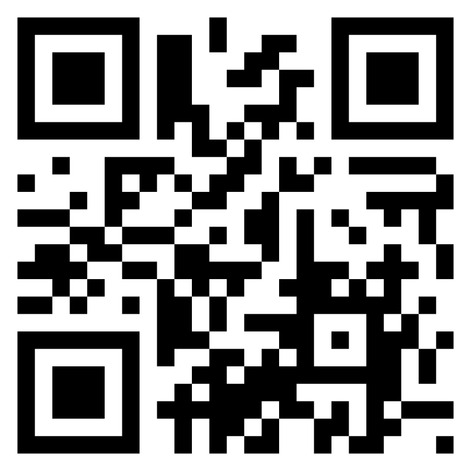
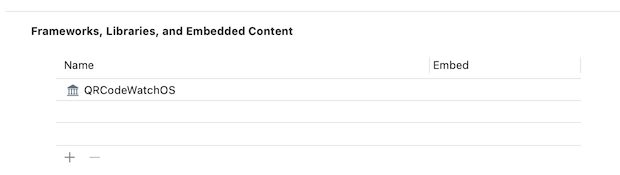

# QRCode

A simple and quick macOS/iOS/tvOS/watchOS QR Code generator/detector library for SwiftUI, Swift and Objective-C.

<p align="center">
    
    
    <a href="https://swift.org/package-manager">
        
    </a>
</p>
<p align="center">
    
    
    
    
    
</p>
<p align="center">
    
    
    
</p>

<p align="center">
   <a href="./Art/screenshot.png">
      
   </a>
   &nbsp;
   <a href="./Art/watchOS.png">
      
   </a>
</p>

## Why?

It's nice to have a simple, quick drop-in component for displaying a QR code when you need one :-).

This also contains a command-line application for generating a qrcode from the command line (`qrcodegen`).

## Features

* Supports Swift and Objective-C.
* Generate a QR code without access to a UI.
* Supports all error correction levels.
* Load/Save support
* Drop-in live display support for SwiftUI, NSView (macOS) and UIView (iOS/tvOS).
* Generate images, scalable PDFs and `CGPath` paths.
* Configurable designs.
* Configurable fill styles (solid, linear gradient, radial gradient) for image generation.
* Command line tool for generating qr codes from the command line (macOS 10.13+).

## Generating a QR Code

The `QRCode.Document` class is the core class you will interact with. It is not tied to any presentation medium and is cross-platform across Apple OSes.

You can use this class to generate a QR Code and present the result as a `CGPath` or a `CGImage`. And if you're using Swift you can retrieve the raw qr code data as a 2D array of `Bool` to use however you need.

You can create a basic black-and-white QR code image very easily.

```swift
let doc = QRCode.Document(utf8String: "Hi there!", errorCorrection: .high)
let generated = doc.cgImage(CGSize(width: 800, height: 800))
```

Generates



You can further style the qr code (see below) 

<details>
<summary>tl;dr Simple Example</summary>
 
```swift
let doc = QRCode.Document()
doc.data = "This is a test".data(using: .utf8)!
doc.errorCorrection = .high

// Set the background color to clear
doc.design.backgroundColor(CGColor.clear)

// Set the foreground color to blue
doc.design.foregroundColor(CGColor.blue)

// Generate a CGPath object containing the QR code
let path = doc.path(CGSize(width: 400, height: 400))

// Generate an image using the default styling (square, black foreground, white background) with 3x resolution
let image = doc.uiImage(CGSize(width: 400, height: 400), scale: 3)

// Generate pdf data containing the qr code
let pdfdata = doc.pdfData(CGSize(width: 400, height: 400))

// Save a JSON representation of the qrcode document
let jsonData = try doc.jsonData()

// Load a qr code from json
let loadedDoc = try QRCode.Document(jsonData: jsonData)
```

</details>

If you have used earlier version of this library, you would have used `QRCode` for generating qr codes. The `QRCode.Document` object wraps both the `QRCode` and the design object for the QR code into a single class to allow loading and saving. Existing code that uses `QRCode` directly will not be affected.

### Special requirements for watchOS

Due to watchOS limitations the `QRCodeWatchOS` products include a [3rd-party QR code generator](https://github.com/fwcd/swift-qrcode-generator) 
for creating a raw QR code.

To use `QRCode` within your watchOS app, you will need to :-

1. Link your project against the `QRCodeWatchOS` library instead of `QRCode`.
2. Import `QRCode3rdPartyGenerator` in your sources **IN ADDITION** to `QRCode`
3. Provide the `QRCodeGeneratorWatchOS` generator when creating your QRCode document.

<details>
<summary>Click here to see a watchOS code example</summary>

```swift
// watchOS generation sample

import QRCode
import QRCode3rdPartyGenerator

let doc = QRCode.Document(generator: QRCodeGeneratorWatchOS())

// Create a qr code containing "Example Text" and set the error correction to high ('H') with the default design
doc.data = "Example text".data(using: .utf8)!
doc.errorCorrection = .high

// And generate a UIImage from the pdf data
let generatedImage = doc.uiImage(CGSize(width: 400, height: 400))
```

**Frameworks, Libraries, and Embedded Content**



</details>

There is also a very basic example called `WatchQR` in the `Demos` folder

Why this additional complexity? Including a 3rd party dependency always introduces more risk. 
If you don't need watchOS support, you should link against `QRCode` and reduce both your code complexity and risk surface.

## Settings

### Set the data content

```swift
/// Set raw data
@objc public var data: Data

/// Set a string
public func setString(
   _ string: String, 
   encoding: String.Encoding = .utf8, 
   allowLossyConversion: Bool = false) -> Bool

/// Set raw data using a qrcode message formatter
@objc func setMessage(_ message: QRCodeMessageFormatter)
```

### Set the error correction

```swift
@objc public var errorCorrection: QRCode.ErrorCorrection = .quantize
```

The `QRCode.Document` has 4 different encoding levels

| Error correction | Description                                          |
|------------------|:-----------------------------------------------------|
| low              | Lowest error correction (L - Recovers 7% of data)    |
| medium           | Medium error correction (M - Recovers 15% of data)   |
| quantize         | Quantize error correction (Q - Recovers 25% of data) |
| high             | High error correction (H - Recovers 30% of data)     |

The higher the error correction level, the larger the QR code will be.

## Design

`QRCode` supports a number of ways of 'designing' your qr code.  By default, the qr code will be generated in its traditional form - square, black foreground and white background. By tweaking the design settings of the qr code you can make it a touch fancier.

The design comprises two components

|        | Description    |
|--------|:--------------------------------------------------------------------------|
| shape  | The shape of each of the individual components within the QR code         |
| style  | The fill styles for each of the individual components within the QR code  |

You can individually specify the shape and fill style for each of the components of the QR code.

### QR code components

The QRCode is made up of four distinct components

* The 'on' data pixels (`onPixels`)
* The eye, which is made up of an `eye` (the outer part of the eye) and a `pupil` (the inner part).
* The 'off' data pixels (`offPixels`)

### Eye shape

You can provide an `EyeShape` object to style just the eyes of the generated qr code. There are built-in generators for
square, circle, rounded rectangle, and more.

| Preview | Name | Class | Description |
|---|---|---|---|
|           |"square"|`QRCode.EyeShape.Square`|Simple square (default)|
|           |"circle"|`QRCode.EyeShape.Circle`|Simple circle|
|      |"roundedRect"|`QRCode.EyeShape.RoundedRect`|Simple rounded rect|
|     |"roundedOuter"|`QRCode.EyeShape.RoundedOuter`|Square with the outer corner rounded|
||"roundedPointingIn"|`QRCode.EyeShape.RoundedPointingIn`|A rounded rect with the 'inner' corner as a point|
|             |"leaf"|`QRCode.EyeShape.Leaf`|An eye that look like a leaf|
|         |"squircle"|`QRCode.EyeShape.Squircle`|A superellipse shape (somewhere between a square and a circle)|

### Data shape

The data shape represents how the 'pixels' within the QR code are displayed.  By default, this is a simple square, 
however you can supply a `PixelShape` object to custom-draw the data.  There are built-in generators for

| Preview | Name | Class | Description |
|---|---|---|---|
|      |"square"|`QRCode.PixelShape.Square`|A basic square pixel (default)|
|      |"circle"|`QRCode.PixelShape.Circle`|A basic circle pixel|
| |"roundedRect"|`QRCode.PixelShape.RoundedRect`|A basic rounded rectangle pixel with configurable radius|
|  |"horizontal"|`QRCode.PixelShape.Horizontal`|The pixels are horizonally joined to make continuous horizontal bars|
|    |"vertical"|`QRCode.PixelShape.Vertical`|The pixels are vertically joined to make continuous vertical bars|
| |"roundedPath"|`QRCode.PixelShape.RoundedPath`|A smooth rounded-edge path|
|    |"squircle"|`QRCode.PixelShape.Squircle`|A superellipse shape (somewhere between a square and a circle)|
|      |"pointy"|`QRCode.PixelShape.Pointy`|A 'pointy' style|

#### 'offPixels' shape (optional)

You can specify a shape to be drawn when a data 'pixel' is _off_. This can be used to make your qr code prettier.
Just remember that the more embellishment you add to a QR code the more difficult it will be to read.

It's really important to make sure that there is a high color contrast between the 'offPixels' shape and the 'onPixels' shape to aid readers.


<details>
<summary>QRCode source</summary>

```swift
let doc1 = QRCode.Document(utf8String: "Hi there noodle")
doc1.design.backgroundColor(NSColor.white.cgColor)
doc1.design.shape.eye = QRCode.EyeShape.RoundedOuter()
doc1.design.shape.onPixels = QRCode.PixelShape.Circle()
doc1.design.style.onPixels = QRCode.FillStyle.Solid(NSColor.systemGreen.cgColor)
doc1.design.shape.offPixels = QRCode.PixelShape.Horizontal(inset: 4, cornerRadiusFraction: 1)
doc1.design.style.offPixels = QRCode.FillStyle.Solid(NSColor.systemGreen.withAlphaComponent(0.4).cgColor)

// Generate a image for the QRCode
let cgImage = doc1.cgImage(CGSize(width: 300, height: 300))
```

</details>

### Fill styles

You can provide a custom fill for any of the individual components of the qr code.

* The 'onPixels'
* The eye (outer)
* The pupil (inner)
* The 'offPixels'


<details>
<summary>QRCode source</summary>

```swift
let doc2 = QRCode.Document(utf8String: "Github example for colors")
doc2.design.backgroundColor(NSColor.white.cgColor)
doc2.design.shape.eye = QRCode.EyeShape.RoundedOuter()
doc2.design.shape.onPixels = QRCode.PixelShape.RoundedPath()

// Eye color
doc2.design.style.eye = QRCode.FillStyle.Solid(NSColor.systemGreen.cgColor)
// Pupil color
doc2.design.style.pupil = QRCode.FillStyle.Solid(NSColor.systemBlue.cgColor)
// Data color
doc2.design.style.onPixels = QRCode.FillStyle.Solid(NSColor.systemBrown.cgColor)

// Generate a image for the QRCode
let cgImage = doc2.cgImage(CGSize(width: 300, height: 300))
```

</details>

This library supports the current fill types.

* solid fill (`QRCode.FillStyle.Solid`)
* linear gradient (`QRCode.FillStyle.LinearGradient`)
* radial gradient (`QRCode.FillStyle.RadialGradient`)

#### Style examples

A simple QRCode with a red radial fill.


<details>
<summary>QRCode source</summary>

```swift
let doc3 = QRCode.Document(utf8String: "Github example for colors")
doc3.design.style.background = QRCode.FillStyle.Solid(CGColor.white)

// Set the fill color for the data to radial gradient
let radial = QRCode.FillStyle.RadialGradient(
   DSFGradient(pins: [
      DSFGradient.Pin(CGColor(red: 0.8, green: 0, blue: 0, alpha: 1), 0),
      DSFGradient.Pin(CGColor(red: 0.1, green: 0, blue: 0, alpha: 1), 1)
   ])!,
   centerPoint: CGPoint(x: 0.5, y: 0.5)
)
doc3.design.style.onPixels = radial

// Generate a image for the QRCode
let cgImage = doc3.cgImage(CGSize(width: 300, height: 300))
```

</details>

## Generating output

### Generate a path

```swift
@objc func path(_ size: CGSize, components: Components, design: QRCode.Design) -> CGPath
```

Produces a CGPath representation of the QRCode

* The size in pixels of the generated path
* The components of the qr code to include in the path (defaults to the standard QR components)
   * The eye 'outer' ring
   * The eye pupil
   * The pixels that are 'on' within the QR Code
   * The pixels that are 'off' within the QR Code
* The shape of the qr components

The components allow the caller to generate individual paths for the QR code components which can then be individually styled and recombined later on. 

For example, the SwiftUI implementation is a Shape object, and you can use a ZStack to overlay each 
component using different a different fill style (for example).

```swift
   let qrContent = QRCodeUI(myData)
   ...
   ZStack {
      qrContent
         .components(.eyeOuter)
         .fill(.green)
      qrContent
         .components(.eyePupil)
         .fill(.teal)
      qrContent
         .components(.onPixels)
         .fill(.black)
   }
```

### Generating a styled image

```swift
@objc func image(_ size: CGSize, scale: CGFloat = 1) -> CGImage?
```

Generate an CGImage from the QR Code, using an (optional) design object for styling the QR code

```swift
@objc func nsImage(_ size: CGSize, scale: CGFloat = 1) -> NSImage?
```

*(macOS only)* Generate an NSImage from the QR Code, using an (optional) design object for styling the QR code

```swift
@objc func uiImage(_ size: CGSize, scale: CGFloat = 1) -> UIImage?
```

*(iOS/tvOS/watchOS/macCatalyst only)* Generate an UIImage from the QR Code, using an (optional) design object for styling the QR code

### Generate a styled, scalable PDF representation of the QR Code

```swift
@objc func pdfData(_ size: CGSize, pdfResolution: CGFloat) -> Data?
```

Generate a scalable PDF from the QRCode using an (optional) design object for styling the QR code and resolution

### Generate a text representation of the QR code

```swift
@objc func asciiRepresentation() -> String
```

Return an ASCII representation of the QR code using the extended ASCII code set

Only makes sense if presented using a fixed-width font.
	
```swift
@objc func smallAsciiRepresentation() -> String
```

Returns an small ASCII representation of the QR code (about 1/2 the regular size) using the extended ASCII code set

Only makes sense if presented using a fixed-width font.

## Message Formatters

There are a number of QRCode data formats that are somewhat common with QR code readers, such as QR codes 
containing phone numbers or contact details.

There are a number of built-in formatters for some common QR Code types. These can be found in the `messages` subfolder.

* URLs (Link)
* Generate an email (Mail)
* A phone number (Phone)
* Contact Details (Contact)
* A UTF-8 formatted string (Text)

## Presentation

This library provides drop-in components for presenting a styled QR code.

### NSView/UIView

`QRCodeView` is an `NSView` (macOS)/`UIView` (iOS/tvOS) implementation for displaying the content of a `QRCode` object.

### SwiftUI

`QRCodeUI` is the SwiftUI implementation which presents as a Shape. So anything you can do with any SwiftUI shape object 
(eg. a rectangle) you can now do with a styled QRCode shape outline. 

For example, you can use `.fill` to set the color content (eg. a linear gradient, solid color etc), add a drop shadow,
add a transform etc...

### Modifiers

```swift
func errorCorrection(_ errorCorrection: QRCode.ErrorCorrection) -> QRCodeUI {
```
Set the error correction level

```swift
func components(_ components: QRCode.Components) -> QRCodeUI
```

Set which components of the QR code to be added to the path

```swift
func contentShape(_ shape: QRCode.Shape) -> QRCodeUI
func eyeShape(_ eyeShape: QRCodeEyeShape) -> QRCodeUI
func pixelShape(_ pixelShape: QRCodePixelShape) -> QRCodeUI
```

Set the shape for the eye/data or both.

<details>
<summary>Example</summary> 

```swift
struct ContentView: View {

   @State var content: String = "This is a test of the QR code control"
   @State var correction: QRCodeView.ErrorCorrection = .low

   var body: some View {
      Text("Here is my QR code")
      QRCode(
         text: content,
         errorCorrection: correction
      )
      .fill(LinearGradient(gradient: gradient, startPoint: .topLeading, endPoint: .bottomTrailing))
      .shadow(color: .black, radius: 1, x: 1, y: 1)
      .frame(width: 250, height: 250, alignment: .center)
   }
}
```
</details>

## Objective-C

The `QRCode` library fully supports Objective-C.

<details>
<summary>Example</summary> 

```objc
QRCode* code = [[QRCode alloc] init];
[code updateWithText: @"This message"
     errorCorrection: QRCodeErrorCorrectionMax];

QRCodeStyle* style = [[QRCodeStyle alloc] init];

// Set the foreground color to a solid red
style.onPixels = [[QRCodeFillStyleSolid alloc] init: CGColorCreateGenericRGB(1, 0, 0, 1)];

// Use the leaf style
style.shape.eyeShape = [[QRCodeEyeStyleLeaf alloc] init];

// Generate the image
CGImageRef image = [code image: CGSizeMake(400, 400) scale: 1.0 style: style];
NSImage* nsImage = [[NSImage alloc] initWithCGImage:image size: CGSizeZero];
```
</details>

## Load/Save

The `QRCode.Document` class has methods for loading/saving QRCode definitions to a JSON format

```swift
let qrCode = QRCode.Document()
qrCode.data = "this is a test".data(using: .utf8)!
qrCode.design.shape.onPixels = QRCode.PixelShape.Circle()
qrCode.design.shape.eye = QRCode.EyeShape.Leaf()

let jsonData = try qrCode.jsonData()

...

let loadedQRCode = try QRCode.Document.Create(jsonData: jsonData)
```

## Detecting QR Codes

### From an image

The library provides a mechanism for detecting QR codes in an image

```swift
// CGImage/NSImage/UIImage detection
if let detected = QRCode.DetectQRCodes(in: /*some image*/),
   detected.count > 0 {
   // Do something with the detected qr codes
   let qrCodeBounds = detected[0].bounds
   let qrCodeMessage = detected[0].messageString
   ...
}
```

### From a video stream

There is a video detector class `QRCode.VideoDetector` which is a very basic qr code detector for video streams.

There are two basic demos demonstrating the qr code detection in a video stream.

* `macOS QRCode Detector`: Video qr code detector for macOS targets
* `iOS QRCode Detector`: Video qr code detector for iOS targets (requires a real device)

## Demo

There are a number of demo apps which you can find in the `Demo` subfolder.  There are simple demo applications for

* SwiftUI (macOS, iOS, macCatalyst, watchOS)
* iOS (Swift, including macCatalyst)
* macOS (Swift and Objective-C)

## Command line tool

You can build the command line tool by opening a terminal window, `cd` into the QRCode folder and build using

`swift build -c release`

The `qrcodegen` tool can be found in the `.build/release` folder.

```zsh
% .build/release/qrcodegen --help
OVERVIEW: Create a qr code

Example: qrcodegen -t "This is a QR code" --output-file "fish.png" 512

* If you don't specify either -t or --input-file, the qrcode content will be read from STDIN
* If you don't specify an output file, the generated qr code will be written to a temporary file
  and opened in the default application.

USAGE: qr-code-gen [<options>] <dimension>

ARGUMENTS:
  <dimension>             The QR code dimension. 

OPTIONS:
  --input-file <input-file>
                          The file containing the content for the QR code 
  --output-file <output-file>
                          The output file 
  --output-format <output-format>
                          The output format (png [default],pdf,ascii,smallascii) 
  --output-compression <output-compression>
                          The output format compression factor (if the output format supports it, png,jpg) 
  -t, --text <text>       The text to be stored in the QR code 
  -s, --silence           Silence any output 
  -c, --error-correction <error-correction>
                          The level of error correction. Available levels are "L" (low), "M" (medium), "Q" (high), "H"
                          (max) 
  -e, --eye-shape <eye-shape>
                          The eye shape to use. Available shapes are circle, leaf, roundedOuter, roundedPointingIn,
                          roundedRect, square, squircle. 
  -d, --on-pixel-shape <on-pixel-shape>
                          The onPixels shape to use. Available shapes are circle, horizontal, pointy, roundedPath,
                          roundedRect, square, squircle, vertical. 
  -n, --inset <inset>     The spacing around each individual pixel in the onPixels section 
  -r, --on-pixel-shape-corner-radius <on-pixel-shape-corner-radius>
                          The onPixels shape corner radius fractional value (0.0 -> 1.0) 
  --bg-color <bg-color>   The background color to use (format r,g,b,a - 1.0,0.5,0.5,1.0) 
  --data-color <data-color>
                          The onPixels color to use (format r,g,b,a - 1.0,0.5,0.5,1.0) 
  --eye-color <eye-color> The eye color to use (format r,g,b,a - 1.0,0.5,0.5,1.0) 
  --pupil-color <pupil-color>
                          The pupil color to use (format r,g,b,a - 1.0,0.5,0.5,1.0) 
  -h, --help              Show help information.
```

### Example

```sh
# Generate a qr code 800x800, png format, using roundedPath for the data, leaf for the eye and a transparent background
.build/release/qrcodegen -c H -d roundedPath -e leaf --bg-color 1.0,1.0,1.0,0.0 -t "qrcode generated by command line" --output-file "output.png" 800
```

## Thanks

### Denso Wave

[Denso Wave](https://www.qrcode.com/en/) 

QR Code is a registered trademark of DENSO WAVE.

### swift-qrcode-generator

Since watchOS doesn't support Core Image filters, I defer to using an (optional) 3rd party for generating QR Codes for
watchOS. It is based on [Nayuki's QR Code generator](https://github.com/nayuki/QR-Code-generator) code.

[swift-qrcode-generator](https://github.com/dagronf/swift-qrcode-generator)

## License

[QRCode](https://github.com/dagronf/QRCode)

```
MIT License

Copyright (c) 2022 Darren Ford

Permission is hereby granted, free of charge, to any person obtaining a copy
of this software and associated documentation files (the "Software"), to deal
in the Software without restriction, including without limitation the rights
to use, copy, modify, merge, publish, distribute, sublicense, and/or sell
copies of the Software, and to permit persons to whom the Software is
furnished to do so, subject to the following conditions:

The above copyright notice and this permission notice shall be included in all
copies or substantial portions of the Software.

THE SOFTWARE IS PROVIDED "AS IS", WITHOUT WARRANTY OF ANY KIND, EXPRESS OR
IMPLIED, INCLUDING BUT NOT LIMITED TO THE WARRANTIES OF MERCHANTABILITY,
FITNESS FOR A PARTICULAR PURPOSE AND NONINFRINGEMENT. IN NO EVENT SHALL THE
AUTHORS OR COPYRIGHT HOLDERS BE LIABLE FOR ANY CLAIM, DAMAGES OR OTHER
LIABILITY, WHETHER IN AN ACTION OF CONTRACT, TORT OR OTHERWISE, ARISING FROM,
OUT OF OR IN CONNECTION WITH THE SOFTWARE OR THE USE OR OTHER DEALINGS IN THE
SOFTWARE.
```

[swift-qrcode-generator](https://github.com/fwcd/swift-qrcode-generator)

```
MIT License

Copyright (c) Project Nayuki. (MIT License)
Copyright (c) 2020 fwcd

Permission is hereby granted, free of charge, to any person obtaining a copy
of this software and associated documentation files (the "Software"), to deal
in the Software without restriction, including without limitation the rights
to use, copy, modify, merge, publish, distribute, sublicense, and/or sell
copies of the Software, and to permit persons to whom the Software is
furnished to do so, subject to the following conditions:

The above copyright notice and this permission notice shall be included in all
copies or substantial portions of the Software.

THE SOFTWARE IS PROVIDED "AS IS", WITHOUT WARRANTY OF ANY KIND, EXPRESS OR
IMPLIED, INCLUDING BUT NOT LIMITED TO THE WARRANTIES OF MERCHANTABILITY,
FITNESS FOR A PARTICULAR PURPOSE AND NONINFRINGEMENT. IN NO EVENT SHALL THE
AUTHORS OR COPYRIGHT HOLDERS BE LIABLE FOR ANY CLAIM, DAMAGES OR OTHER
LIABILITY, WHETHER IN AN ACTION OF CONTRACT, TORT OR OTHERWISE, ARISING FROM,
OUT OF OR IN CONNECTION WITH THE SOFTWARE OR THE USE OR OTHER DEALINGS IN THE
SOFTWARE.
```
